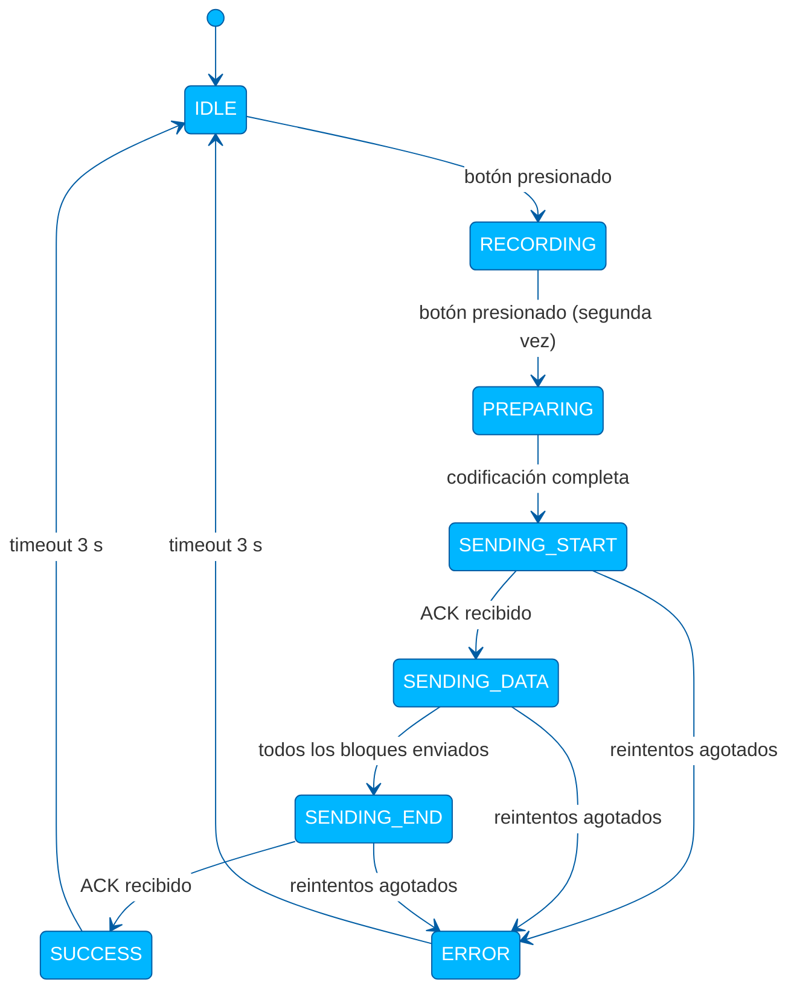
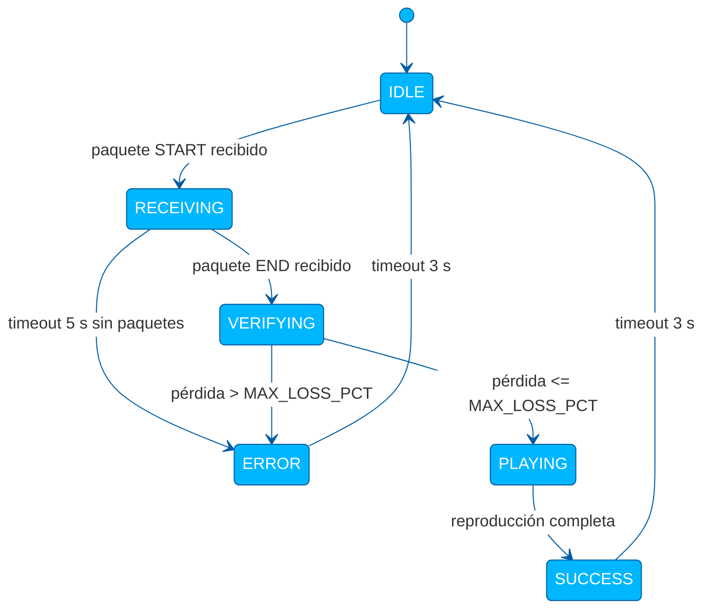

# ie0527-proyecto

El presente repositorio contiene el proyecto desarrollado para el curso IE0527: Ingeniería de Comunicaciones, correspondiente a un sistema de dos nodos (_transmisor_ y _receptor_) basados en Raspberry Pi Zero que captura, transmite y reproduce mensajes de voz de forma inalámbrica usando el _transceiver_ nRF24L01+PA+LNA en la banda ISM de 2.4 GHz, sin emplear protocolos de red de alto nivel.

> **Integrantes:**
>
> - Daniel Sáenz Obando
> - Marlon Gutiérrez Vásquez
> - Andrés Víquez Zamora
> - Guillermo Escobar Arrieta

---

## 1. Enunciado del proyecto

El sistema debe capturar un mensaje de voz en el nodo transmisor, transmitirlo de forma inalámbrica y reproducirlo en el nodo receptor, usando únicamente la banda ISM.
Cada nodo opera con un solo microprocesador, cuenta con autonomía energética, un botón para iniciar la operación y LEDs de señalización.
El receptor permanece en espera continua hasta detectar una transmisión entrante.

### Desempeño mínimo

Distancia de 30 m con línea de vista:

| Criterio           | Valor requerido            |
| ------------------ | -------------------------- |
| Audio recibido     | Inteligible y reproducible |
| Tiempo por intento | <= 60 s                    |

### Desempeño óptimo

| Criterio                         | Requisito                         | Resultado                                        |
| -------------------------------- | --------------------------------- | ------------------------------------------------ |
| Tiempo total para los 3 mensajes | < 150 s                           | **Cumplido**                                     |
| Compresión de datos              | Implementar algún mecanismo       | **Cumplido** (IMA ADPCM)                         |
| Distancia extendida              | 100 m con línea de vista          | **Cumplido**                                     |
| Distancia sin línea de vista     | 50 m con obstáculos               | **Cumplido**                                     |
| Confiabilidad adicional          | Detección/recuperación de errores | **Cumplido** (retransmisiones ESB/`APP_RETRIES`) |

---

## 2. Arquitectura del sistema

```mermaid
%%{init: {'theme': 'base', 'themeVariables': {'edgeLabelBackground': '#FFFFFF', 'lineColor': '#005DA4'}}}%%
flowchart LR
    classDef container fill:#DDDDDD,stroke:#005DA4,stroke-width:1px,color:#005DA4
    classDef node      fill:#00B6FF,stroke:#005DA4,stroke-width:1.5px,color:#FFFFFF

    subgraph TX["tx"]
        MIC["INMP441<br/>Micrófono I2S"]
        PIPE["Pipeline de audio<br/>Captura / ganancia / ADPCM"]
        FSM_TX["FSM TX<br/>8 estados"]
        NRF_TX["nRF24L01+PA+LNA"]
    end

    subgraph RX["rx"]
        NRF_RX["nRF24L01+PA+LNA"]
        FSM_RX["FSM RX<br/>6 estados"]
        DEC["Decodificador<br/>IMA ADPCM"]
        DAC["PCM5102<br/>DAC I2S"]
    end

    MIC --> PIPE
    PIPE --> FSM_TX
    FSM_TX --> NRF_TX
    NRF_TX -.->|"RF 2.4 GHz / 1 Mbps<br/>canal 76 (ISM)"| NRF_RX
    NRF_RX --> FSM_RX
    FSM_RX --> DEC
    DEC --> DAC

    class TX,RX container
    class MIC,PIPE,FSM_TX,NRF_TX,NRF_RX,FSM_RX,DEC,DAC node
```



> El enlace usa el mecanismo _Enhanced ShockBurst_ del nRF24L01, que implementa CRC de 16 bits, auto-ACK y hasta 15 retransmisiones automáticas por paquete a nivel de hardware, más 5 reintentos adicionales a nivel de aplicación.

---

## 3. Estructura del código

La estructura del repositorio se resume a continuación:

```
ie0527-proyecto/
├── src/
│   ├── config.py             # Parámetros compartidos
│   ├── common.py             # Funciones comunes en tx/rx para procesamiento
│   ├── radio.py              # Inicialización del nRF24L01
│   ├── leds.py               # Señalización con los tres LEDs
│   ├── tx.py                 # Nodo transmisor
│   ├── rx.py                 # Nodo receptor
│   ├── requirements.txt      # Dependencias de Python
│   └── setup/
│       ├── install.sh        # Instala dependencias y habilita el servicio systemd
│       ├── audio-tx.service  # Servicio tx
│       └── audio-rx.service  # Servicio rx
├── avance_01/                # Reporte del avance 1
├── avance_02/                # Reporte del avance 2
└── reporte/                  # Reporte final
```

En la siguiente tabla se describen los contenidos de los archivos de código fuente:

| Archivo                      | Descripción                                                                      |
| ---------------------------- | -------------------------------------------------------------------------------- |
| [`config.py`](src/config.py) | Parámetros compartidos (RF, audio, pines GPIO). Igual en ambos nodos.            |
| [`common.py`](src/common.py) | Protocolo de aplicación (`START`/`DATA`/`END`), _pipeline_ de audio e IMA ADPCM. |
| [`radio.py`](src/radio.py)   | Inicialización y configuración del nRF24L01 vía `pyRF24`.                        |
| [`leds.py`](src/leds.py)     | Señalización con los tres LEDs (`gpiozero`).                                     |
| [`tx.py`](src/tx.py)         | Nodo transmisor: FSM de 8 estados.                                               |
| [`rx.py`](src/rx.py)         | Nodo receptor: FSM de 6 estados (escucha continua).                              |

---

## 4. Protocolo de aplicación

Sobre _Enhanced ShockBurst_ se define un protocolo de tres tipos de mensaje dentro del payload de 32 bytes:

```
START : 0x01 | total_blocks (2 B) | fs (2 B) | bits (1 B) | channels (1 B) | codec (1 B)
DATA  : 0x02 | seq (2 B)          | audio (<= 29 B)
END   : 0x03
```

- `total_blocks` lo conoce el transmisor antes de enviar.
- `codec`: `0x00` = PCM lineal 8 bits, `0x02` = IMA ADPCM 4 bits/muestra.
- El receptor detecta el códec automáticamente por el campo del START.
- El último bloque DATA puede ser parcial gracias al _payload_ de longitud dinámica del nRF24.

---

## 5. Máquinas de estado

### Transmisor (`tx.py`)



### Receptor (`rx.py`)



Los bloques DATA se almacenan en un diccionario `{seq: bytes}` y al recibir el END se ordenan por clave y se concatenan, tolerando llegadas fuera de orden.
Los números de secuencia faltantes se rellenan con silencio (`0x80` en PCM, `0x00` en ADPCM) antes de decodificar.

---

## 6. Cableado

- **nRF24L01+PA+LNA** (ambos nodos, SPI0)

| Señal módulo | GPIO   |
| ------------ | ------ |
| CE           | GPIO25 |
| CSN          | GPIO8  |
| MISO         | GPIO9  |
| MOSI         | GPIO10 |
| SCLK         | GPIO11 |
| VCC          | 3.3 V  |
| GND          | GND    |

> [!NOTE]
> Se conectó un capacitor de 10 µF entre las terminales de VCC y GND porque el _transceiver_ tiene picos altos de corriente eléctrica al transmitir.

- **INMP441** (solo nodo TX, micrófono I2S)

| Señal módulo | GPIO   |
| ------------ | ------ |
| SCK          | GPIO18 |
| WS           | GPIO19 |
| SD           | GPIO20 |
| L/R          | GND    |
| VDD          | 3.3 V  |
| GND          | GND    |

- **PCM5102** (solo nodo RX, DAC I2S)

| Señal módulo | GPIO   |
| ------------ | ------ |
| BCK          | GPIO18 |
| LRCK         | GPIO19 |
| DIN          | GPIO21 |
| VIN          | 5 V    |
| GND          | GND    |
| XSMT         | 3.3 V  |
| FMT          | GND    |
| DEMP         | GND    |
| SCK          | GND    |

- **Botón y LEDs** (ambos nodos)

| Elemento     | GPIO   |
| ------------ | ------ |
| Botón        | GPIO17 |
| LED verde    | GPIO27 |
| LED amarillo | GPIO22 |
| LED rojo     | GPIO23 |

> [!NOTE]
> Se utilizaron resistores de 220 ohms para limitar la corriente eléctrica y evitar dañar los LEDs.

---

## 7. Configuración

Algunos de los parámetros de `config.py` contemplados son:

| Parámetro      | Valor por defecto | Descripción                                                 |
| -------------- | ----------------- | ----------------------------------------------------------- |
| `RF_CHANNEL`   | 76                | Canal RF (0-125)                                            |
| `RF_DATA_RATE` | `"1Mbps"`         | Tasa de datos del nRF24 (`"250kbps"`, `"1Mbps"`, `"2Mbps"`) |
| `CODEC`        | `"adpcm"`         | Códec de audio del transmisor: `"pcm"` o `"adpcm"`          |
| `MIC_GAIN`     | `1.0`             | Ganancia digital aplicada al micrófono                      |
| `MAX_LOSS_PCT` | `5.0`             | Tolerancia máxima de pérdida en el receptor (%)             |

---

## 8. Puesta en marcha

### 8.1 Grabar la microSD

1. Insertar la microSD en la computadora.
2. Descargar e instalar **Raspberry Pi Imager** desde <https://www.raspberrypi.com/software/>.
3. Seleccionar dispositivo: _Raspberry Pi Zero_, sistema: _Raspberry Pi OS Lite (32-bit)_.
4. En **Editar ajustes** configurar hostname (`tx` o `rx`), usuario, contraseña, WiFi y habilitar SSH.
5. Grabar y esperar a que termine.

### 8.2 Habilitar SPI, I2S y el overlay de audio

Con la microSD aún en la computadora, editar `config.txt` en la partición `bootfs`:

```ini
dtparam=spi=on
dtparam=i2s=on

[all]
# Nodo TX (micrófono)
dtoverlay=googlevoicehat-soundcard
# Nodo RX (DAC PCM5102)
dtoverlay=hifiberry-dac
```

> [!IMPORTANT]
> Cada nodo lleva **solo su** overlay de audio.

### 8.3 Primer arranque y SSH

```bash
ssh tx@tx.local         # o rx@rx.local
```

### 8.4 Actualizar e instalar dependencias

```bash
sudo apt update && sudo apt full-upgrade -y
sudo apt install -y git
```

### 8.5 Clonar e instalar

```bash
cd ~
git clone https://github.com/dan1elsaenz/ie0527-proyecto
cd ie0527-proyecto/src
sudo ./setup/install.sh tx   # en el transmisor
sudo ./setup/install.sh rx   # en el receptor
```

> El instalador instala las dependencias Python y habilita el servicio `systemd` para que el nodo arranque automáticamente en cada encendido.

## 9. Uso

El **receptor** arranca con el servicio y queda en espera (LED verde fijo).

En el **transmisor**: presionar el botón **inicia** la grabación; presionar de nuevo la **detiene** e inicia la transmisión automáticamente.

### Código de LEDs

| Estado                     | Verde           | Amarillo        | Rojo |
| -------------------------- | --------------- | --------------- | ---- |
| Listo / espera             | Fijo            | —               | —    |
| Grabando                   | —               | Parpadeo lento  | —    |
| Transmitiendo / recibiendo | —               | Parpadeo rápido | —    |
| Reproduciendo (`rx`)       | Fijo            | Fijo            | —    |
| Éxito                      | Parpadeo rápido | —               | —    |
| Error                      | —               | —               | Fijo |
